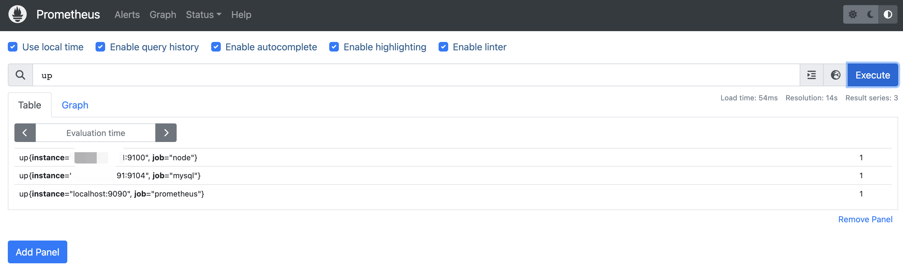
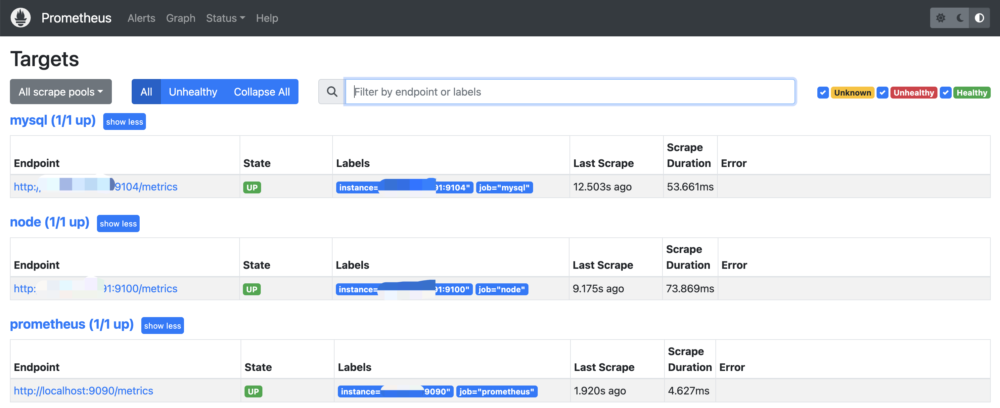
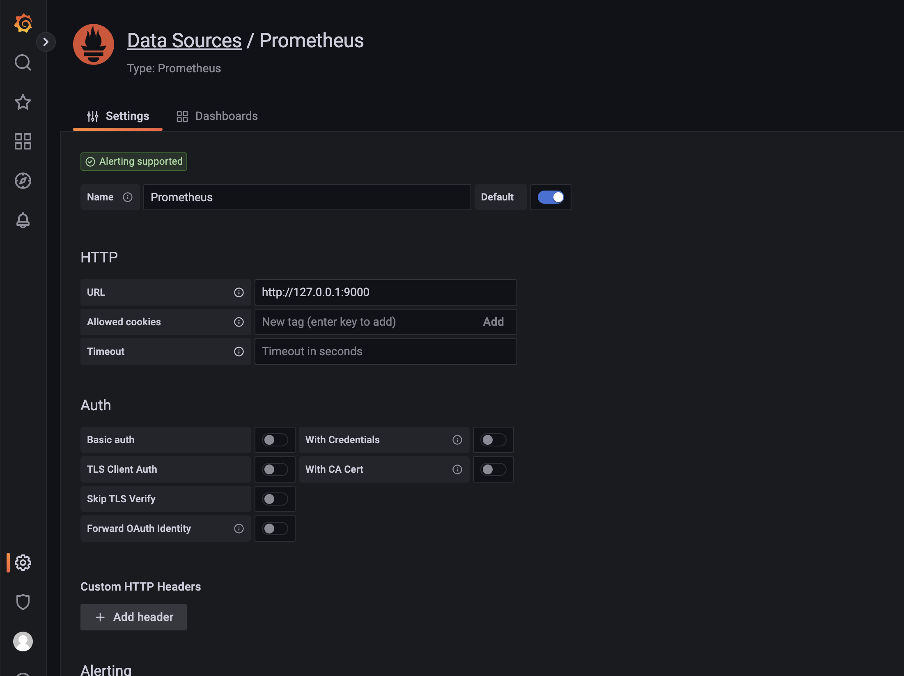
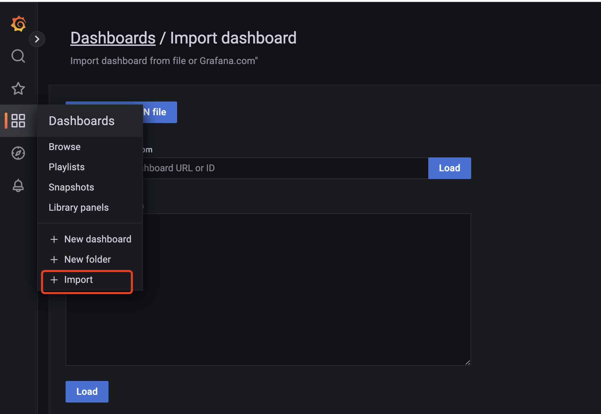

# prometheus部署

简介：由于资源有限，本实验用了两台机器

1. 监控端：部署prometheus、grafana、alertmanager
2. 被监控端：node_exporter、mysqld_exporter

## 一. 部署promethus

### 1. 下载

https://prometheus.io/download/

### 2. 解压

​	`mkdir -p /data/prometheus`

​	`tar -zxvf /root/prometheus-2.42.0.linux-amd64.tar.gz -C /data/`

​	`cd /data`

​	`mv prometheus-2.42.0.linux-amd64/ prometheus`

### 3. 部署

- 创建prometheus用户

​		`useradd  -s /sbin/nologin -M prometheus`

​		`mkdir  -p /data/database/prometheus`

​		`chown -R prometheus:prometheus /data/database/prometheus/`

- 配置systemctl启动项

​		`vim /etc/systemd/system/prometheus.service`

```bash
[Unit]
Description=Prometheus
Documentation=https://prometheus.io/
After=network.target
[Service]
Type=simple
User=prometheus
ExecStart=/data/prometheus/prometheus --web.enable-lifecycle --config.file=/data/prometheus/prometheus.yml --storage.tsdb.path=/data/database/prometheus
Restart=on-failure
[Install]
WantedBy=multi-user.target
```

### 4. 加载配置&启动服务

​	`systemctl daemon-reload`

​	`systemctl start prometheus`

​	`systemctl status prometheus`

​	`systemctl enable prometheus`

- 访问web页面，IP:9090

- 查看到监控的数据，IP:9090/metrics


## 二. 监控linux主机

### 1. 下载node_exporter

​	`wget https://github.com/prometheus/node_exporter/releases/download/v1.5.0/node_exporter-1.5.0.linux-amd64.tar.gz`

### 2.解压

​	`tar -zxvf node_exporter-1.5.0.linux-amd64.tar.gz -C /data/`

​	`mv /data/node_exporter-1.5.0.linux-amd64/ /data/node_exporter`

### 3. 配置systemctl启动项

​	`vim /etc/systemd/system/node_exporter.service`

```bash
[Unit]
Description=node_exporter
[Service]
ExecStart=/data/source.package/node_exporter-1.1.2.linux-amd64/node_exporter
ExecReload=/bin/kill -HUP $MAINPID
KillMode=process
Restart=on-failure
[Install]
WantedBy=multi-user.target
```

### 4. 加载配置&启动服务

​	`systemctl daemon-reload`

​	`systemctl start node_exporter.service`

​	`systemctl status node_exporter.service`

​	`systemctl enable node_exporter.service`

- 查看到被监控的数据，IP:9100/metrics

### 5. 监控端配置

- 在主配置文件最后加上下面三行
  
  `vim /data/prometheus/prometheus.yml`

```bash
- job_name: 'agent1' #取一个job名称来代表被监控的机器
    static_configs:
    - targets: ['192.168.1.1:9100'] # 这里改成被监控机器的IP，后面端口接9100
```

- 测试prometheus.yaml文件有无报错

```bash
[root@VM-16-2-centos prometheus]# ./promtool check config prometheus.yml
Checking prometheus.yml
 SUCCESS: prometheus.yml is valid prometheus config file syntax
```

### 6. 重新加载prometheus配置文件
- `curl -X POST http://127.0.0.1:9090/-/reload`，打开prometheus页面输入up查看是不是有对应的数据了

  

- 回到web管理界面 ——>点——>点Targets ——>可以看到多了一台监控目标


## 三. 监控mysql

### 1. 下载mysqld_exporter

​	`wget https://github.com/prometheus/mysqld_exporter/releases/download/v0.14.0/mysqld_exporter-0.14.0.linux-amd64.tar.gz2`

### 2. 解压

​	`tar -zxvf mysqld_exporter-0.14.0.linux-amd64.tar.gz  -C /data/`

​	`mv /data/mysqld_exporter-0.14.0.linux-amd64/ /data/mysqld_exporter`	

```bash
[root@VM-12-2-centos ~]# ls /data/mysqld_exporter/
LICENSE  mysqld_exporter  NOTICE
```

### 3. 安装mariadb数据库,并授权

​	`yum -y install mariadb-server -y`

​	`systemctl start mariadb`

```bash
[root@VM-12-2-centos ~]# mysql
Welcome to the MariaDB monitor.  Commands end with ; or \g.
Your MariaDB connection id is 2
Server version: 5.5.68-MariaDB MariaDB Server

Copyright (c) 2000, 2018, Oracle, MariaDB Corporation Ab and others.

Type 'help;' or '\h' for help. Type '\c' to clear the current input statement.

MariaDB [(none)]>
MariaDB [(none)]> grant select,replication client,process ON *.* to 'mysql_monito'@'localhost' identified by '123';
Query OK, 0 rows affected (0.00 sec)

MariaDB [(none)]>
MariaDB [(none)]> flush privileges;
Query OK, 0 rows affected (0.00 sec)

MariaDB [(none)]>
MariaDB [(none)]> exit
Bye
```

### 4. 启动

​	 `nohup /usr/local/mysqld_exporter/mysqld_exporter --config.my-cnf=/usr/local/mysqld_exporter/.my.cnf & `

### 5. 监控端配置

​	`vim /data/prometheus/prometheus.yml`

```bash
  - job_name: 'mysql' #取一个job名称来代表被监控的机器
    static_configs:
      - targets: ['192.168.1.1:9104'] # 这里改成被监控机器的IP，后面端口接9104
```

### 6. 重启prometheus

​	`systemctl restart prometheus`

- 回到web管理界面 ——>点——>点Targets ——>可以看到多了一台监控目标




## 四. 部署grafana

### 1. 下载

​	`wget https://dl.grafana.com/enterprise/release/grafana-enterprise-9.3.6.linux-amd64.tar.gz`

### 2. 解压

​	`tar -zxvf grafana-enterprise-9.3.6.linux-amd64.tar.gz  -C /data`

​	`mv grafana-9.3.6/ grafana`

### 3.  修改初始化文件

- 备份

​		`cp /data/grafana/conf/defaults.ini /data/grafana/conf/defaults.ini.bak`

- 修改

​		`vim /data/grafana/conf/defaults.ini `

```bash
data = /data/database/grafana/data
logs = /data/database/grafana/log
plugins = /data/database/grafana/plugins
provisioning = /data/grafana/conf/provisioning/
```

### 4. 配置systemctl启动项

​	`vim /etc/systemd/system/grafana-server.service`

```bash
[Unit]
Description=Grafana
After=network.target
[Service]
User=grafana
Group=grafana
Type=notify
ExecStart=/data/grafana/bin/grafana-server -homepath /data/grafana/
Restart=on-failure
[Install]
WantedBy=multi-user.target
```

### 5. 加载配置&启动服务

`systemctl daemon-reload`

`systemctl start grafana-server.service`

`systemctl status grafana-server.service`

`systemctl enable grafana-server.service`

- web页面：ip+3000

  - 默认账号密码都是admin admin，登陆时需要修改密码。


### 6. 配置grafana

- 添加prometheus监控数据及模板，将grafana和prometheus关联起来，也就是在grafana中添加添加数据源

  - 点击：设置->Data Source->Add data source->选择prometheus->url内填写http://IP:9090->save&test



- 点击：左边栏Dashboards“+”号内import->输入“8919”->load->更改name为“Prometheus Node”->victoriaMetrics选择刚创建的数据源“prometheus”

  - 如要使用其他的模板，请到grafana的官网去查找 https://grafana.com/dashboards\

  

- 设置完成后，点击"Dashboards"，->"victoriaMetrics"->"Prometheus Node"

  


## 五、部署alertmanager

### 1. 下载

​	https://prometheus.io/download/

### 2. 解压

​	`tar -zxvf alertmanager-0.25.0.linux-amd64.tar.gz -C /data/`

​	`cd /data`

​	`mv alertmanager-0.25.0.linux-amd64/ alertmanager`

​	`chown -R prometheus:prometheus /data/alertmanager`

​	`mkdir -p /data/alertmanager/data`

### 3. 配置报警系统altermanger服务

 `vim /data/alertmanager/alertmanager.yml`（最初配置）
```bash
global:
  resolve_timeout: 5m
route:
  group_by: ['alertname']
  group_wait: 10s
  group_interval: 10s
  repeat_interval: 1h
  receiver: 'web.hook'
receivers:
- name: 'web.hook'
  webhook_configs:
  - url: 'http://127.0.0.1:5001/'
inhibit_rules:
  - source_match:
      severity: 'critical'
    target_match:
      severity: 'warning'
    equal: ['alertname', 'dev', 'instance']
```

### 4. 配置systemctl启动项

​	`vim /etc/systemd/system/alertmanager.service`

```bash
[Unit]
Description=Alertmanager
After=network.target
[Service]
Type=simple
User=prometheus
ExecStart=/data/alertmanager/alertmanager --config.file=/data/alertmanager/alertmanager.yml --storage.path=/data/alertmanager/data
Restart=on-failure
[Install]
WantedBy=multi-user.target
```

### 5. 加载配置&启动服务

​	`systemctl daemon-reload`

​	`systemctl start alertmanager.service`

​	`systemctl status alertmanager.service`

​	`systemctl enable alertmanager.service`

### 6. 配置promethues.yam

​	`cp /data/prometheus/prometheus.yml /data/prometheus/prometheus.yml.bak`

​	`vim /data/prometheus/prometheus.yml `（job_name中有几台监控的机器就写几行）

```bash
alerting:
  alertmanagers:
  - static_configs:
    - targets:
	  - 192.168.1.1:9093

rule_files:
  - "/data/database/prometheus/rules/*.rules"

scrape_configs:
  # The job name is added as a label `job=<job_name>` to any timeseries scraped from this config.
  - job_name: 'prometheus'

    # metrics_path defaults to '/metrics'
    # scheme defaults to 'http'.

    static_configs:
    - targets: ['192.168.1.1:9090']


  - job_name: 'node'
    static_configs:
    - targets: ['192.168.1.2:9100']
    - targets: ['192.168.1.3:9100']
    - targets: ['192.168.1.4:9100']
```

- 测试prometheus.yaml文件有无报错（可以检测出rules文件有无报错）

​	`cd /data/prometheus`

​	`./promtool check config prometheus.yml`

```bash
[root@VM-16-2-centos prometheus]# ./promtool check config prometheus.yml
Checking prometheus.yml
  SUCCESS: 1 rule files found
 SUCCESS: prometheus.yml is valid prometheus config file syntax

Checking /data/database/prometheus/rules/node.rules
  SUCCESS: 21 rules found
```

### 7. 创建prometheus的规则文件

​	`mkdir /data/database/prometheus/rules`

​	`vim /data/database/prometheus/rules/node.rules`

```shell
groups:
  - name: Node-rules
    rules:
    - alert: Node-Down
      expr: up{job="node1"} == 0
      for: 1m
      labels:
        severity: 严重警告
        instance: "{{ $labels.instance }}"
      annotations:
        summary: "{{$labels.instance }} 节点已经宕机 1分钟"
        description: "节点宕机"

    - alert: Node-CpuHigh
      expr: (1 - avg by (instance) (irate(node_cpu_seconds_total{job="node",mode="idle"}[5m]))) * 100 > 80
      for: 1m
      labels:
        severity: 警告
        instance: "{{ $labels.instance }}"
      annotations:
        summary: "{{ $labels.instance }} cpu使用率超 80%"
        description: "CPU 使用率为 {{ $value }}%"

    - alert: Node-CpuIowaitHigh
      expr: avg by (instance) (irate(node_cpu_seconds_total{job="node",mode="iowait"}[5m])) * 100 > 80
      for: 1m
      labels:
        severity: 警告
        instance: "{{ $labels.instance }}"
      annotations:
        summary: "{{ $labels.instance }} CPU iowait 使用率超过 80%"
        description: "CPU iowait 使用率为 {{ $value }}%"

    - alert: Node-MemoryHigh
      expr: (1 - node_memory_MemAvailable_bytes{job="node"} / node_memory_MemTotal_bytes{job="node"}) * 100 > 80
      for: 1m
      labels:
        severity: 警告
        instance: "{{ $labels.instance }}"
      annotations:
        summary: "{{ $labels.instance }} Memory使用率超过 80%"
        description: "Memory 使用率为 {{ $value }}%"

    - alert: Node-Load5High
      expr: node_load5 > (count by (instance) (node_cpu_seconds_total{job="node",mode='system'})) * 1.2
      for: 1m
      labels:
        severity: 警告
        instance: "{{ $labels.instance }}"
      annotations:
        summary: "{{ $labels.instance }} Load(5m)过高,超出cpu核数1.2倍"
        description: "Load(5m)过高,超出cpu核数 1.2倍"

    - alert: Node-DiskRootHigh
      expr: (1 - node_filesystem_avail_bytes{job="node",fstype=~"ext.*|xfs",mountpoint ="/"} / node_filesystem_size_bytes{job="node",fstype=~"ext.*|xfs",mountpoint ="/"}) * 100 > 80
      for: 10m
      labels:
        severity: 警告
        instance: "{{ $labels.instance }}"
      annotations:
        summary: "{{ $labels.instance }} Disk(/ 分区) 使用率超过 80%"
        description: "Disk(/ 分区) 使用率为 {{ $value }}%"

    - alert: Node-DiskDataHigh
      expr: (1 - node_filesystem_avail_bytes{job="node",fstype=~"ext.*|xfs",mountpoint ="/data"} / node_filesystem_size_bytes{job="node",fstype=~"ext.*|xfs",mountpoint ="/data"}) * 100 > 80
      for: 10m
      labels:
        severity: 警告
        instance: "{{ $labels.instance }}"
      annotations:
        summary: "{{ $labels.instance }} Disk(/data 分区) 使用率超过 80%"
        description: "Disk(/data 分区) 使用率为 {{ $value }}%"

    - alert: Node-DiskReadHigh
      expr: irate(node_disk_read_bytes_total{job="node"}[5m]) > 20 * (1024 ^ 2)
      for: 1m
      labels:
        severity: 警告
        instance: "{{ $labels.instance }}"
      annotations:
        summary: "{{ $labels.instance }} Disk 读取字节数速率超过 20 MB/s"
        description: "Disk 读取字节数速率为 {{ $value }}MB/s"

    - alert: Node-DiskWriteHigh
      expr: irate(node_disk_written_bytes_total{job="node"}[5m]) > 20 * (1024 ^ 2)
      for: 1m
      labels:
        severity: 警告
        instance: "{{ $labels.instance }}"
      annotations:
        summary: "{{ $labels.instance }} Disk 写入字节数速率超过 20 MB/s"
        description: "Disk 写入字节数速率为 {{ $value }}MB/s"

    - alert: Node-DiskReadRateCountHigh
      expr: irate(node_disk_reads_completed_total{job="node"}[5m]) > 3000
      for: 1m
      labels:
        severity: 警告
        instance: "{{ $labels.instance }}"
      annotations:
        summary: "{{ $labels.instance }} Disk iops 每秒读取速率超过 3000 iops"
        description: "Disk iops 每秒读取速率为 {{ $value }}"

    - alert: Node-DiskWriteRateCountHigh
      expr: irate(node_disk_writes_completed_total{job="node"}[5m]) > 3000
      for: 1m
      labels:
        severity: 警告
        instance: "{{ $labels.instance }}"
      annotations:
        summary: "{{ $labels.instance }} Disk iops 每秒写入速率超过 3000 iops"
        description: "Disk iops 每秒写入速率为 {{ $value }}"

    - alert: Node-InodeRootUsedPercentHigh
      expr: (1 - node_filesystem_files_free{job="node",fstype=~"ext4|xfs",mountpoint="/"} / node_filesystem_files{job="node",fstype=~"ext4|xfs",mountpoint="/"}) * 100 > 80
      for: 10m
      labels:
        severity: 警告
        instance: "{{ $labels.instance }}"
      annotations:
        summary: "{{ $labels.instance }} Disk (/ 分区) inode 使用率超过 80%"
        description: "Disk (/ 分区) inode 使用率为 {{ $value }}%"

    - alert: Node-InodeBootUsedPercentHigh
      expr: (1 - node_filesystem_files_free{job="node",fstype=~"ext4|xfs",mountpoint="/data"} / node_filesystem_files{job="node",fstype=~"ext4|xfs",mountpoint="/data"}) * 100 > 80
      for: 10m
      labels:
        severity: 警告
        instance: "{{ $labels.instance }}"
      annotations:
        summary: "{{ $labels.instance }} Disk (/data 分区) inode 使用率超过 80%"
        description: "Disk (/data 分区) inode 使用率为 {{ $value }}%"

    - alert: Node-FilefdAllocatedPercentHigh
      expr: node_filefd_allocated{job="node"} / node_filefd_maximum{job="node"} * 100 > 80
      for: 10m
      labels:
        severity: 警告
        instance: "{{ $labels.instance }}"
      annotations:
        summary: "{{ $labels.instance }} Filefd 打开百分比超过 80%"
        description: "Filefd 打开百分比为 {{ $value }}%"

    - alert: Node-NetworkNetinBitRateHigh
      expr: avg by (instance) (irate(node_network_receive_bytes_total{device=~"eth0|eth1|ens33|ens37"}[1m]) * 8) > 20 * (1024 ^ 2) * 8
      for: 3m
      labels:
        severity: 警告
        instance: "{{ $labels.instance }}"
      annotations:
        summary: "{{ $labels.instance }} Network 接收比特数速率超过 20MB/s"
        description: "Network 接收比特数速率为 {{ $value }}MB/s"

    - alert: Node-NetworkNetoutBitRateHigh
      expr: avg by (instance) (irate(node_network_transmit_bytes_total{device=~"eth0|eth1|ens33|ens37"}[1m]) * 8) > 20 * (1024 ^ 2) * 8
      for: 3m
      labels:
        severity: 警告
        instance: "{{ $labels.instance }}"
      annotations:
        summary: "{{ $labels.instance }} Network 接收比特数速率超过 20MB/s"
        description: "Network 发送比特数速率为 {{ $value }}MB/s"

    - alert: Node-NetworkNetinPacketErrorRateHigh
      expr: avg by (instance) (irate(node_network_receive_errs_total{device=~"eth0|eth1|ens33|ens37"}[1m])) > 15
      for: 3m
      labels:
        severity: 警告
        instance: "{{ $labels.instance }}"
      annotations:
        summary: "{{ $labels.instance }} Network 接收错误包速率超过 15个/秒"
        description: "Network 接收错误包速率为 {{ $value }}个/秒"

    - alert: Node-NetworkNetoutPacketErrorRateHigh
      expr: avg by (instance) (irate(node_network_transmit_packets_total{device=~"eth0|eth1|ens33|ens37"}[1m])) > 15
      for: 3m
      labels:
        severity: 警告
        instance: "{{ $labels.instance }}"
      annotations:
        summary: "{{ $labels.instance }} Network 发送错误包速率超过 15个/秒"
        description: "Network 发送错误包速率为 {{ $value }}个/秒"

    - alert: Node-ProcessBlockedHigh
      expr: node_procs_blocked{job="node"} > 10
      for: 10m
      labels:
        severity: 警告
        instance: "{{ $labels.instance }}"
      annotations:
        summary: "{{ $labels.instance }} Process 当前被阻塞的任务的数量超过 10个"
        description: "Process 当前被阻塞的任务的数量为 {{ $value }}个"

    - alert: Node-TimeOffsetHigh
      expr: abs(node_timex_offset_seconds{job="node"}) > 3 * 60
      for: 2m
      labels:
        severity: 警告
        instance: "{{ $labels.instance }}"
      annotations:
        summary: "{{ $labels.instance }} 节点的时间偏差超过 3m"
        description: "节点的时间偏差为 {{ $value }}m"

    - alert: Node-TCPconnection
      expr: node_sockstat_TCP_tw{job="node"} > 15000
      for: 2m
      labels:
        severity: 警告
        instance: "{{ $labels.instance }}"
      annotations:
        summary: "{{ $labels.instance }} TCP 等待关闭的TCP连接数TIME_WAIT过高大于15000"
        description: "TCP 等待关闭的TCP连接数为 {{ $value }}"
```


### 8. 配置alertmanager邮件报警

​	`vim /data/alertmanager/alertmanager.yml`

```shell
# 全局配置项
global:
  resolve_timeout: 5m #处理超时时间，默认为5min
  smtp_smarthost: 'smtp.qq.com:465' #邮箱smtp服务器代理
  smtp_from: '111111112@qq.com' #发送邮箱名称
  smtp_auth_username: '111111112@qq.com' #邮箱名称
  smtp_auth_password: 'asdklfjwiehrqc' #邮箱授权码
  smtp_require_tls: false
  smtp_hello: 'qq.com'

# 定义报警模板
templates:
  - '/data/alertmanager/email.tmpl'

# 定义路由树信息
route:
  group_by: ['alertname'] #报警分组依据
  group_wait: 10s #最初即第一次等待多久时间发送一组警报的通知
  group_interval: 10s #在发送新警报前的等待时间
  repeat_interval: 10m #发送重复警报的周期 对于email配置中，此项不可以设置过低，否则将会由于邮件发送太多频繁，被smtp服务器拒绝
  receiver: 'email' #发送警报的接收者的名称，以下receivers name的名称

# 定义警报接收者信息
receivers:
  - name: 'email' # 警报
    email_configs: # 邮箱配置
    - to: '1111111112@qq.com, hello@163.com' #添加多个邮箱中间用,+空格分开
      html: '{{ template "email.html" . }}'
      send_resolved: true

# 一个inhibition规则是在与另一组匹配器匹配的警报存在的条件下，使匹配一组匹配器的警报失效的规则。两个警报必须具有一组相同的标签。
inhibit_rules:
  - source_match:
      severity: 'critical'
    target_match:
      severity: 'warning'
    equal: ['alertname', 'dev', 'instance']
```

### 9. 创建自定义报警模板
​	`vim /data/alertmanager/email.tmpl`

```bash
{{ define "email.html" }}
{{- if gt (len .Alerts.Firing) 0 -}}
{{- range $index, $alert := .Alerts -}}
 <pre>
======== 异常告警 ========
告警类型：{{ $alert.Labels.alertname }}
告警级别：{{ $alert.Labels.severity }}
告警实例：{{ $alert.Labels.instance }}
告警应用: {{ $alert.Labels.name }}
告警信息：{{ $alert.Annotations.summary }}
告警详情：{{ $alert.Annotations.description }}
告警时间：{{ $alert.StartsAt.Local }}
========== END ==========
 </pre>
{{- end }}
{{- end }}
{{- if gt (len .Alerts.Resolved) 0 -}}
{{- range $index, $alert := .Alerts -}}
 <pre>
======== 告警恢复 ========
告警类型：{{ $alert.Labels.alertname }}
告警级别：{{ $alert.Labels.severity }}
告警实例：{{ $alert.Labels.instance }}
告警详情：{{ $alert.Annotations.description }}
告警应用: {{ $alert.Labels.name }}
当前状态: OK
告警时间：{{ $al：ert.StartsAt.Local }}
恢复时间：{：{ $alert.EndsAt.Local }}
========== END ==========
 </pre>
{{- end }}
{{- end }}
{{- end }}
```

### 10. 重启服务
​	`systemctl restart prometheus.service`

​	`systemctl restart alertmanager.service`

### 11. 页面验证

- web页面：ip+9090上点击alert选项查看是否存在规则
  

### 12. 邮件告警


